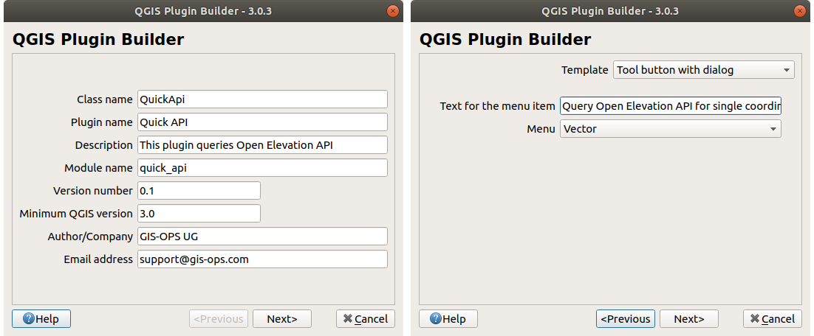
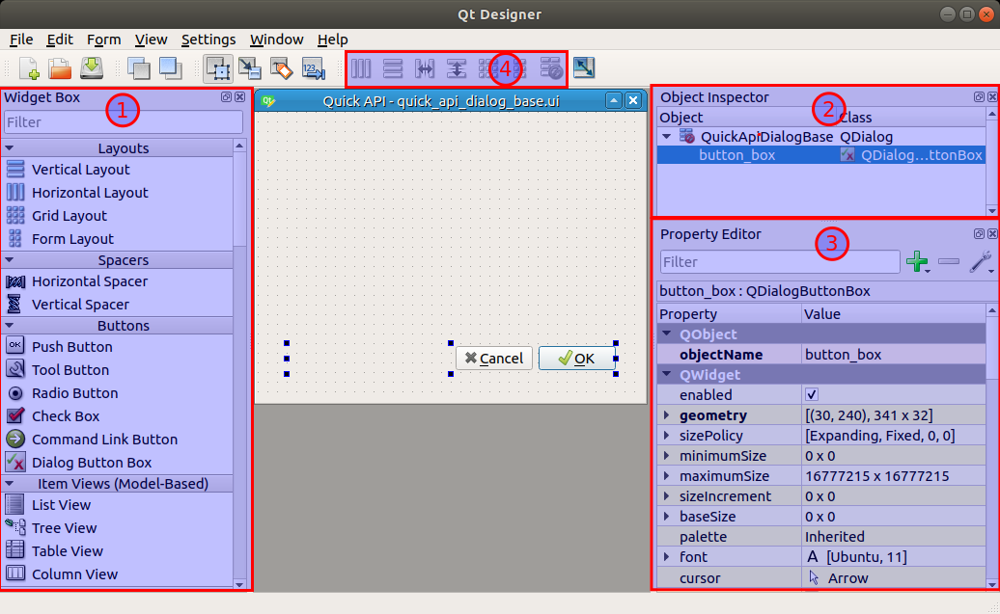
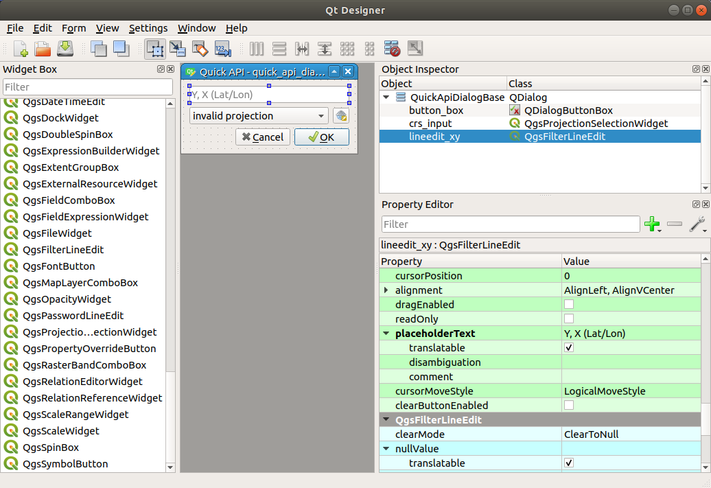

# Create a quick QGIS 3 Plugin

This tutorial is not intended to be a deep dive into QGIS plugins, but rather a guideline for creating a plugin from available boiler plate code based on the very useful [Plugin Builder](http://g-sherman.github.io/Qgis-Plugin-Builder/).

**Goals**:

- get more familiar with `PyQGIS` and `PyQt5` and the respective documentation
- build a GUI with QGIS native Qt Designer
- connect GUI elements to Python functions
- deploy the plugin locally and upload to QGIS official plugin repository

**Plugin functionality**:

- User copy/pastes X, Y coordinates into a text field
- Upon OK button click, the [Open Elevation API] is queried
- A z-enabled Point layer is generated in-memory

The usefulness of the plugin is highly debatable but you will understand important concepts by the end.

> **Disclaimer**
>
> Validity only confirmed for **Ubuntu 18.04** and **QGIS v3.x**
> Occassionally, the author might choose to give hints on Windows-specific setups. `Ctrl+F` for WINDOWS flags

## Table of Contents

<!-- TOC depthFrom:2 depthTo:4 withLinks:1 updateOnSave:1 orderedList:0 -->

- [Prerequisites](#prerequisites)
	- [Hard prerequisites](#hard-prerequisites)
	- [Recommendations](#recommendations)
- [First steps](#first-steps)
	- [Plugin Builder](#plugin-builder)
		- [About Plugin Builder](#about-plugin-builder)
		- [Run Plugin Plugin Builder](#run-plugin-plugin-builder)
		- [Generated files](#generated-files)
	- [Test initial plugin](#test-initial-plugin)
		- [Compile `resources.qrc`](#compile-resourcesqrc)
		- [Copy code to plugin directory](#copy-code-to-plugin-directory)
		- [Load plugin](#load-plugin)
		- [Troubleshooting](#troubleshooting)
- [Build GUI](#build-gui)
	- [](#)

<!-- /TOC -->

## Prerequisites

### Hard prerequisites

- Basic understanding of Python
- QGIS v3.x
- [Plugin Builder](https://plugins.qgis.org/plugins/pluginbuilder3/) QGIS plugin installed
- Python >= 3.6 (should be your system Python3)

### Recommendations

- Use an IDE, such as [Sypder](https://www.spyder-ide.org) or [PyCharm](https://www.jetbrains.com/pycharm/)
- Even though we're developing **on** Ubuntu, we should make sure Windows users can use the plugin as well. **Doesn't seem like there is a list for OSGeo4W python packages, awaiting answer from dev list**
- Use the system's Python3 as interpreter for your IDE: `/usr/bin/python3`
- **WINDOWS**: you're locked in with OSGeo4W for QGIS, but you can have a look [here](https://trac.osgeo.org/osgeo4w/wiki/ExternalPythonPackages#UsestandardWindowsinstallers) on how to change your default Python interpreter to the one shipped with OSGeo4W, for a better developing experience

If you follow above recommendations, you should now be able to run the following in your IDE's Python console:

```bash
import qgis
import PyQt5
```

If that was successful, you're all set to start the development!

## First steps

### Plugin Builder

#### About Plugin Builder

The Plugin Builder arguably takes a lot of work off your shoulders, as it creates all necessary boiler plate code you need to immediately start development. However, we found the amount of (well-intended) overhead it imposes on developers a little overwhelming in the beginning. Consequently, we'll focus for the rest of the tutorial on the most crucial parts of your new plugin and ignore the rest.

#### Run Plugin Plugin Builder

If you have successfully installed the Plugin Builder 3 plugin, it is available in the 'Plugins' menu in QGIS. Make sure to fill out the details similar to ours:



Note, there will be a few more dialogs, just use common sense when filling those in. Or accept the defaults.

After confirming where to store your new plugin, you'll presented with a dialog detailing what to find where and which steps to take from here. For the sake of this tutorial, ignore its contents. If anything goes wrong with the short descriptions it provides you'll be left with more questions than answers.

#### Generated files

The Plugin Builder will have generated a lot of files now. Head over to your new plugin project directory and `ll .`. To avoid confusion and make it as simple as possible, you can safely delete all files and folders except for these:

```bash
├──quickapi
   ├──i18n
   |  └──af.ts
   ├──icon.png
   ├──__init__.py
   ├──metadata.txt
   ├──quick_api.py
   ├──quick_api_dialog.py
   ├──quick_api_dialog_base.ui
   ├──resources.py
   └──resources.qrc
```

This is still a lot to take in. So let's look at them in little more detail:

- `i18n`: this folder contains translation files. Just note, that you will have the folder present for now so the plugin doesn't crash. A detailed explanation is beyond the scope of this tutorial.

- `icon.png`: the default icon for the plugin. You will change this to reflect your own icon.

- `__init__.py`: contains the function which will initialize the plugin on QGIS startup and register it with QGIS, so it knows about this plugin.

- `metadata.txt`: contains information about the plugin, which will be used by the official QGIS plugin repository and the QGIS Plugin Manager to display information about your plugin, e.g. description, version, URL etc.

- `quick_api.py`: contains the heart of the plugin: all custom functionality will go into this file.

- `quick_api_dialog.py`: loads the User Interface (UI), when QGIS starts up. You won't alter this file in this tutorial.

- `quick_api_dialog_base.ui`: this is the Qt Designer file to style and build the UI, i.e. plugin window.

- `resource.qrc`: contains the resources for Qt. It's usually only needed to tell QGIS where to find the plugin icon. You will only edit this file when you rename or otherwise change the plugin icon. **Needs to be compiled to resources.py**.

### Test initial plugin

At this point you can already test if QGIS loads your new (very unfunctional) plugin.

#### Compile `resources.qrc`

First you need to compile the `resources.qrc` file to `resources.py`, so that the plugin can pick up the Qt settings:

```bash
pyrcc5 -o resources.py resources.qrc
```

#### Copy code to plugin directory

Next, you should create the directory where your plugin will be picked up by QGIS on startup and copy all files there:

```bash
cp -arf ../quickapi $HOME/.local/share/QGIS/QGIS3/profiles/default/python/plugins/
```

Run this command whenever you change something in your development project.

#### Load plugin

Start QGIS and head over to `Plugins > Manage and Install Plugins` et voila:


If you activate it, note how a toolbar icon is created. Also, you'll find the plugin in the 'Vector' menu in QGIS. No worries, you'll change all that:)

#### Troubleshooting

- if you don't see the plugin in the manager after a QGIS restart, check you didn't accidentally set the `experimental` flag by allowing experimental plugins in `Plugin Manager > Settings`.

- if you experience a Python error, you likely did something wrong in the previous steps. Best bet: start from scratch before you dump an inconceivable amount of time in finding the bug.

## Qt Designer

First, start Qt Designer. The app is shipped on all OS's with QGIS and should be available as an executable on your computer.

### Short roundup of Qt Designer

In the startup dialog, open `quickapi/quick_api_dialog_base.ui` and you'll see your bare-bone plugin UI. For easier navigation, here's a quick breakdown of the Qt Designer interface:



#### 1 Available widgets

In Qt lingo all GUI elements are classified as `Widgets`, which can have all kinds of actual UI functionality like buttons, containers or user input elements. Drag a few widgets into your dialog and experiment a bit. There's also a few custom QGIS widgets at the very bottom, which provide additional functionality (like CRS picker)

#### 2 Object inspector

You can click on widgets in your dialog to select them. But sometimes it's good to see the hierarchy of widgets or select it from a list, e.g. when they're overlapping each other in the dialog.

#### 3 Property Editor

Each widget exposes a list of properties, like geometry or font, which you will find in this panel. You didn't see any actual code yet, but these properties are accessible methods through the Python class of your GUI. So it's also a good reference to available widget properties to be modified. It gives you a whole lot more information though:
- the name you give the widget
- the PyQt5 class name, e.g. `QDialogButtonBox` for the OK/Cancel button group
- you can immediately see the sub-classing for each widget by examining the tabs of the Property dialog. E.g. the `QDialogButtonBox` is sub-classed from (in descending order):
	- `QObject`, which only exposes the `objectName` property and will be widget identifier in your code
	- `QWidget`, which exposes multiple properties, mostly layout related
	- and finally `QDialogButtonBox`, which has mostly functional properties, e.g. which buttons are displayed

#### 4 Layout toolbar

Quick access to different layout for container widgets. Explanation follows in [a following section](#important-qt-designer-concepts).

### Build GUI

You will build a very simple GUI: only a small box where the user can paste a X, Y coordinate pair.

Do the following steps:

1. Select the dialog window and press `Lay Out Vertically` button in the [toolbar](#layout-toolbar)
2. Drag a line edit widget above the buttons (`Input Widgets > Line Edit`)
3. Alter the following properties:
	- `QObject.objectName`: lineedit_xy
	- Check `QWidget.font.Italic`
	- `QLineEdit.text`: Lat, Long

Now, your GUI should look like this:



### Important Qt Designer concepts

- Every container widget needs a layout! In your case that's only the `QDialog` dialog window containing both the line edit widget and `QDialogButtonBox`. Layouts help you in... well, layouting (to keep consistent spacing when resizing etc.). Try other layout types and add a few more widgets to see the differences.

- Every widget needs a unique name defined in `QObject.objectName`! If you extend your plugin with more widgets, try to be structured with widget names. It'll help you a lot when you access them in your code later on.

## Code

In this tutorial we will throw a few fundamental programming principles over board and focus only on the most crucial parts of a QGIS plugin. To this end, we will **not**:

- separate GUI logic from processing logic
- write unit tests

Shame on us, really. That's for another day.

### 
